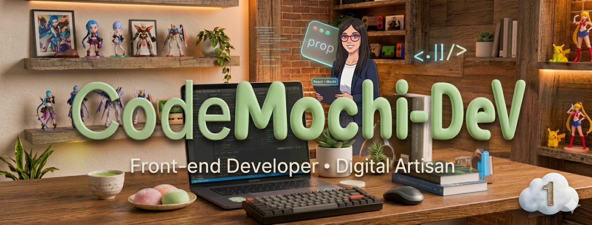
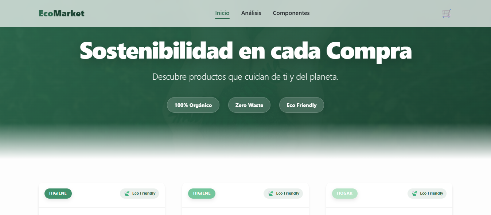
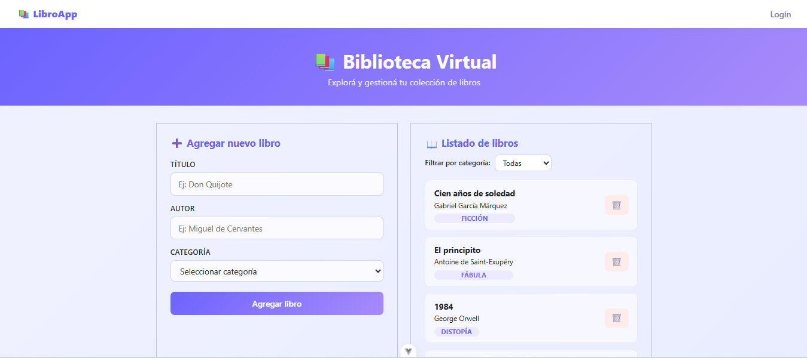
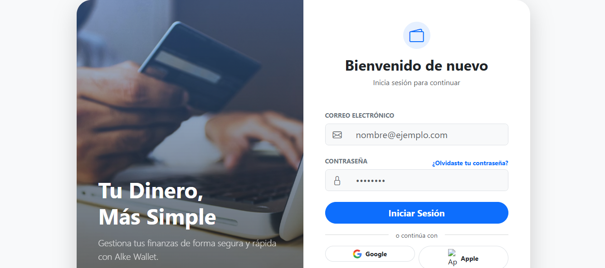
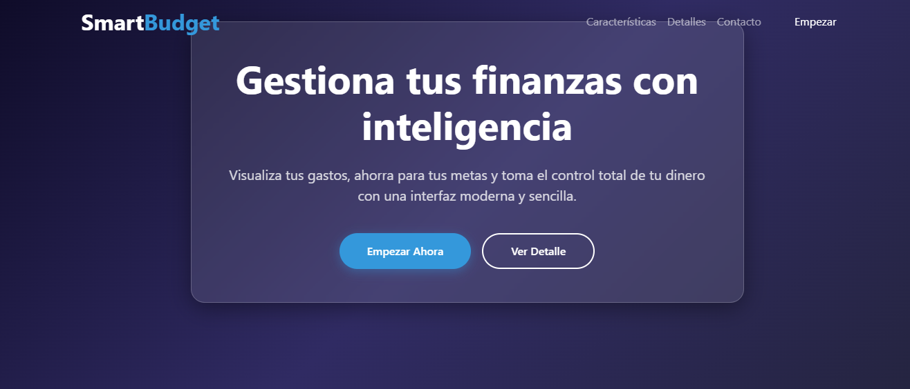

 

---

### 👋 Hola, soy Valentina Llantén

💡 **Transformo ideas en productos digitales rápidos, escalables y visualmente atractivos.**

📍 *Santiago, Chile*

 

 

## 🧠 Sobre mí

Desarrolladora Frontend con una fuerte inclinación hacia la **UX, el rendimiento y el diseño moderno**. Me apasiona crear interfaces que no solo funcionen perfectamente, sino que también cautiven al usuario. Actualmente, estoy expandiendo mis horizontes hacia el ecosistema **Full Stack con Java**.

- 🎯 **Enfoque:** Frontend con Vue.js & UX/UI
- 🚀 **Evolución:** Aprendiendo Spring Boot & Arquitecturas escalables
- 🌱 **Mentalidad:** Aprendizaje continuo y atención al detalle

---

## 🛠️ Tech Stack

<table align="center">
  <tr>
    <td align="center" width="33%">
      <strong>Frontend</strong>  
      
      
      
      
      
    </td>
    <td align="center" width="33%">
      <strong>Backend & DB</strong>  
      
      
      
    </td>
    <td align="center" width="33%">
      <strong>Herramientas</strong>  
      
      
      
      
    </td>
  </tr>
</table>

---

## 🚀 Proyectos Destacados

| Proyecto | Descripción | Preview |
| :--- | :--- | :--- |
| **EcoMarket** | SPA con Vue 3, Pinia y diseño moderno. |  |
| | [🚀 Demo](https://valentinapazllr-ops.github.io/analisis-de-caso-Ecomarket/) · [💻 Código](https://github.com/valentinapazllr-ops/analisis-de-caso-Ecomarket) | |
| **LibroApp** | CRUD completo con Firebase Realtime Database. |  |
| | [🚀 Demo](https://m6-abp.vercel.app/login) · [💻 Código](https://github.com/valentinapazllr-ops/M6-ABP) | |
| **Alkemi Wallet** | Fintech app con flujo de usuario y diseño moderno. |  |
| | [🚀 Demo](https://valentinapazllr-ops.github.io/alke-wallet1-deployment/) · [💻 Código](https://github.com/valentinapazllr-ops/alke-wallet1) | |
| **SmartBudget** | Gestión financiera personal enfocada en UX. |  |
| | [🚀 Demo](https://valentinapazllr-ops.github.io/Proyecto-ABP-M3/) · [💻 Código](https://github.com/valentinapazllr-ops/Proyecto-ABP-M3) | |

---

## 📊 GitHub Stats

 

---

## ⚡ Actualmente...

| Status | Topic |
| :--- | :--- |
| 🌱 **Aprendiendo** | Java Full Stack (Spring Boot) |
| 🧠 **Explorando** | Arquitectura Frontend avanzada & Clean Code |
| 🚀 **Mejorando** | Web Performance & Core Web Vitals |
| 🤝 **Buscando** | Nuevos retos como Frontend Developer |

 

  

 avanzada
🚀 Mejorando      Performance & Core Web Vitals
🤝 Buscando       Oportunidades como desarrolladora
` ` `
